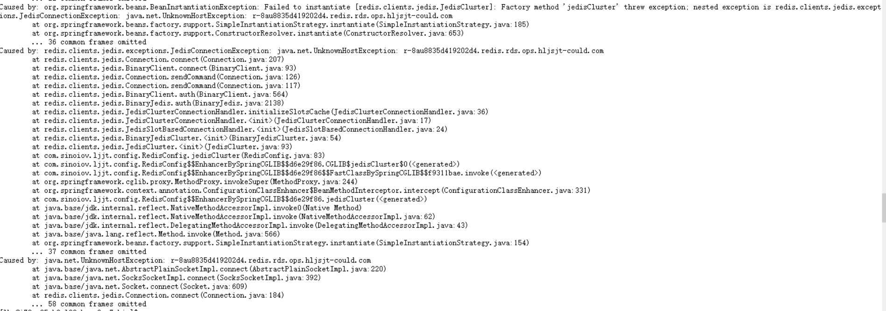

# 关于REDIS集群模式配置不适配阿里云单节点引发的报错及其解决方案

## 事件回顾

> 项目环境
>
> - `springboot` 2.4.4
>
> 相关maven依赖
>
> ```xml
> <dependency>
>     <groupId>redis.clients</groupId>
>     <artifactId>jedis</artifactId>
>     <version>2.9.0</version>
> </dependency>
> <dependency>
>     <groupId>org.springframework.boot</groupId>
>     <artifactId>spring-boot-starter-data-redis</artifactId>
> </dependency>
> ```
>
> 

在黑龙江交投项目的开发过程中，开发环境`REDIS`配置一直用的是***集群模式***配置，`REDIS`服务也是由我们自己在公司的服务器节点搭建的，具体详细配置如下

```yaml
jedis:
  cluster:
    nodes: 172.17.47.159:7001,172.17.47.159:7002,172.17.47.159:7003,172.17.47.159:7004,172.17.47.159:7005,172.17.47.159:7006
    timeout: 3000
    soTimeout: 3000
    maxAttempts: 5
    maxTotal: 20
    minIdle: 5
    maxIdle: 5
    maxWaitMillis: 5000
    testWhileIdle: true
    minEvictableIdleTimeMillis: 1800000
    timeBetweenEvictionRunsMillis: 300000
    numTestsPerEvictionRun: 2
    password: XXXX
```

代码中我们操作`REDIS`的组件是`JedisCluster`，其实例化过程如下

```java
package com.sinoiov.ljjt.config;

import org.springframework.beans.factory.annotation.Value;
import org.springframework.context.annotation.Bean;
import org.springframework.context.annotation.Configuration;
import redis.clients.jedis.HostAndPort;
import redis.clients.jedis.JedisCluster;
import redis.clients.jedis.JedisPoolConfig;

import java.util.HashSet;
import java.util.Set;

/**
 * RedisConfig
 *
 * @author lky
 * @version 1.0.0
 * @description redis配置
 * @date 2021/6/28 16:52
 */
@Configuration
public class RedisConfig {

    @Value("${jedis.cluster.nodes}")
    private String nodes;

    @Value("${jedis.cluster.timeout}")
    private int timeout;

    @Value("${jedis.cluster.maxTotal}")
    private int maxTotal;

    @Value("${jedis.cluster.minIdle}")
    private int minIdle;

    @Value("${jedis.cluster.maxIdle}")
    private int maxIdle;

    @Value("${jedis.cluster.maxWaitMillis}")
    private int maxWaitMillis;

    @Value("${jedis.cluster.testWhileIdle}")
    private boolean  testWhileIdle;

    @Value("${jedis.cluster.minEvictableIdleTimeMillis}")
    private long minEvictableIdleTimeMillis;

    @Value("${jedis.cluster.timeBetweenEvictionRunsMillis}")
    private long timeBetweenEvictionRunsMillis;

    @Value("${jedis.cluster.numTestsPerEvictionRun}")
    private int numTestsPerEvictionRun;

    @Value("${jedis.cluster.password}")
    private String password;

    @Value("${jedis.cluster.soTimeout}")
    private int soTimeout;

    @Value("${jedis.cluster.maxAttempts}")
    private int maxAttempts;

    @Bean
    public JedisCluster jedisCluster() {

        Set<HostAndPort> jedisClusterNodes = new HashSet<>();
        String [] serverArray=nodes.split(",");
        for (String redisAddr : serverArray) {
            String[] hostAndPort = redisAddr.split(":");
            jedisClusterNodes.add(new HostAndPort(hostAndPort[0], Integer.parseInt(hostAndPort[1])));
        }

        // 配置连接池的参数
        var poolConfig = new JedisPoolConfig();
        poolConfig.setMaxTotal(maxTotal);
        poolConfig.setMaxWaitMillis(maxWaitMillis);
        poolConfig.setMinIdle(minIdle);
        poolConfig.setMaxIdle(maxIdle);
        poolConfig.setTestWhileIdle(testWhileIdle);
        poolConfig.setMinEvictableIdleTimeMillis(minEvictableIdleTimeMillis);
        poolConfig.setTimeBetweenEvictionRunsMillis(timeBetweenEvictionRunsMillis);
        poolConfig.setNumTestsPerEvictionRun(numTestsPerEvictionRun);

        return new JedisCluster(jedisClusterNodes, timeout, soTimeout, maxAttempts, password, poolConfig);
    }
}
```

操作示例

```java
@Autowired
private JedisCluster jedisCluster;

jedisCluster.expire(ZC_TOKEN_PREFIX + token, TOKEN_TIME_OUT_SECONDS);
```

### 错误发生

项目准备上线，由于客户`REDIS`是购买的阿里云的`REDIS`服务，而且是单节点的，想当然的将客户提供的阿里云`REDIS`地址配置在`jedis.cluster.nodes`节点上，如下

```yaml
jedis:
  cluster:
    nodes: r-8au8835d419202d4.redis.rds.ops.hljsjt-could.com
    password: xxxxx
```

线上启动项目，报错`UnknownHostException`



## 解决方案

> *其中`RedisTemplateConfig.java`和`RedisService.java`代码由**刘俊**同学贡献，特此感谢*

> 将`REDIS`配置由集群模式替换为单节点配置，操作`REDIS`组件有`JedisCluster`改为`springboot`默认提供的`RedisTemplate`，具体配置如下
>
> ```yaml
> spring:
>   redis:
>     password: xxxxx
>     host: r-8au8835d419202d4.redis.rds.ops.hljsjt-could.com
>     port: 6379
>     timeout: 3000
>     jedis:
>       pool:
>         max-active: 1000
>         max-idle: 500
>         max-wait: 10000 #最大等待时间ms
> ```


> `RedisTemplate`配置 `RedisTemplateConfig.java`
>
> ```java
> package com.sinoiov.ljjt.config;
> 
> import org.springframework.context.annotation.Bean;
> import org.springframework.context.annotation.Configuration;
> import org.springframework.data.redis.connection.RedisConnectionFactory;
> import org.springframework.data.redis.core.*;
> import org.springframework.data.redis.serializer.StringRedisSerializer;
> 
> /**
>  * @author : liujun
>  * @date : 2021/3/11 13:54
>  */
> @Configuration
> public class RedisTemplateConfig {
> 
>     @Bean
>     public RedisTemplate<String, String> redisTemplate(RedisConnectionFactory factory) {
>         RedisTemplate<String, String> template = new RedisTemplate<>();
>         template.setConnectionFactory(factory);
> 
>         // 使用 StringRedisSerializer 替换默认的 jdkSerializeable 序列化
>         StringRedisSerializer stringRedisSerializer = new StringRedisSerializer();
> 
>         // key采用String的序列化方式
>         template.setKeySerializer(stringRedisSerializer);
>         // hash的key也采用String的序列化方式
>         template.setHashKeySerializer(stringRedisSerializer);
>         // value序列化方式采用String的序列化方式
>         template.setValueSerializer(stringRedisSerializer);
>         // hash的value序列化方式采用String的序列化方式
>         template.setHashValueSerializer(stringRedisSerializer);
>         template.afterPropertiesSet();
>         return template;
>     }
> 
>     @Bean
>     public HashOperations<String, String, String> hashOperations(RedisTemplate<String, String> redisTemplate) {
>         return redisTemplate.opsForHash();
>     }
> 
>     @Bean
>     public ValueOperations<String, String> valueOperations(RedisTemplate<String, String> redisTemplate) {
>         return redisTemplate.opsForValue();
>     }
> 
>     @Bean
>     public ListOperations<String, String> listOperations(RedisTemplate<String, String> redisTemplate) {
>         return redisTemplate.opsForList();
>     }
> 
>     @Bean
>     public SetOperations<String, String> setOperations(RedisTemplate<String, String> redisTemplate) {
>         return redisTemplate.opsForSet();
>     }
> 
>     @Bean
>     public ZSetOperations<String, String> zSetOperations(RedisTemplate<String, String> redisTemplate) {
>         return redisTemplate.opsForZSet();
>     }
> 
> }
> ```

> 因为`JedisCluster`和`RedisTemplate`操作`REDIS`的方法的方法签名略有差异，遂新建了`RedisService`客户端类在`RedisTemplate`支持下进行进一步的包装，其中常用方法的方法签名保持与`JedisCluster`一致，方便后续代码调整.`RedisService`源码如下，需要的同学可自行拷贝
>
> ```java
> package com.sinoiov.ljjt.config;
> 
> import com.alibaba.fastjson.JSON;
> import com.alibaba.fastjson.JSONObject;
> import com.google.common.collect.Lists;
> import org.slf4j.Logger;
> import org.slf4j.LoggerFactory;
> import org.springframework.beans.factory.annotation.Autowired;
> import org.springframework.data.redis.core.*;
> import org.springframework.stereotype.Component;
> import org.springframework.util.CollectionUtils;
> 
> import java.util.Collection;
> import java.util.List;
> import java.util.Map;
> import java.util.Set;
> import java.util.concurrent.TimeUnit;
> 
> /**
>  * redis相关操作统一类
>  *
>  * @author liujun
>  * @version 1.0
>  */
> @Component
> public class RedisService {
>     private final static Logger LOG = LoggerFactory.getLogger(RedisService.class);
> 
>     @Autowired
>     private RedisTemplate<String, String> redisTemplate;
> 
>     @Autowired
>     private ValueOperations<String, String> redisValueOperations;
> 
>     @Autowired
>     private HashOperations<String, String, String> redisHashOperations;
> 
>     @Autowired
>     private ListOperations<String, String> redisListOperations;
> 
>     @Autowired
>     private SetOperations<String, String> redisSetOperations;
> 
>     /**
>      * 指定缓存失效时间
>      *
>      * @param key  键
>      * @param time 时间(秒)
>      * @return
>      */
>     public boolean expire(String key, long time) {
>         try {
>             if (time > 0) {
>                 redisTemplate.expire(key, time, TimeUnit.SECONDS);
>             }
>             return true;
>         } catch (Exception e) {
>             LOG.error("", e);
>             return false;
>         }
>     }
> 
>     /**
>      * 根据key 获取过期时间
>      *
>      * @param key 键 不能为null
>      * @return 时间(秒) 返回0代表为永久有效
>      */
>     public long getExpire(String key) {
>         return redisTemplate.getExpire(key, TimeUnit.SECONDS);
>     }
> 
>     /**
>      * 判断key是否存在
>      *
>      * @param key 键
>      * @return true 存在 false不存在
>      */
>     public boolean hasKey(String key) {
>         try {
>             return redisTemplate.hasKey(key);
>         } catch (Exception e) {
>             LOG.error("", e);
>             return false;
>         }
>     }
> 
>     /**
>      * 删除缓存
>      *
>      * @param key 可以传一个值 或多个
>      */
>     @SuppressWarnings("unchecked")
>     public void del(String... key) {
>         if (key != null && key.length > 0) {
>             if (key.length == 1) {
>                 redisTemplate.delete(key[0]);
>             } else {
>                 redisTemplate.delete((Collection<String>) CollectionUtils.arrayToList(key));
>             }
>         }
>     }
> 
>     //============================String=============================
> 
>     /**
>      * 普通缓存获取
>      *
>      * @param key 键
>      * @return 值
>      */
>     public String get(String key) {
>         return key == null ? null : redisValueOperations.get(key);
>     }
> 
>     public <T> T getObject(String key, Class<T> clazz) {
>         String json = this.get(key);
>         if (json == null) {
>             return null;
>         }
>         T obj = JSON.parseObject(json.toString(), clazz);
>         return obj;
>     }
> 
>     public <T> List<T> getList(String key, Class<T> clz) {
>         String json = this.get(key);
>         if (json == null) {
>             return Lists.newArrayList();
>         }
>         List<T> list = JSONObject.parseArray(json.toString(), clz);
>         return list;
>     }
> 
>     /**
>      * 普通缓存放入
>      *
>      * @param key   键
>      * @param value 值
>      * @return true成功 false失败
>      */
>     public boolean set(String key, String value) {
>         try {
>             redisValueOperations.set(key, value);
>             return true;
>         } catch (Exception e) {
>             LOG.error("", e);
>             return false;
>         }
> 
>     }
> 
>     /**
>      * 普通缓存放入并设置时间
>      *
>      * @param key   键
>      * @param value 值
>      * @param time  时间(秒) time要大于0 如果time小于等于0 将设置无限期
>      * @return true成功 false 失败
>      */
>     public boolean set(String key, String value, long time) {
>         try {
>             if (time > 0) {
>                 redisValueOperations.set(key, value, time, TimeUnit.SECONDS);
>             } else {
>                 set(key, value);
>             }
>             return true;
>         } catch (Exception e) {
>             LOG.error("", e);
>             return false;
>         }
>     }
> 
>     /**
>      * 递增
>      *
>      * @param key   键
>      * @param delta 要增加几(大于0)
>      * @return
>      */
>     public long incr(String key, long delta) {
>         if (delta < 0) {
>             throw new RuntimeException("递增因子必须大于0");
>         }
>         return redisValueOperations.increment(key, delta);
>     }
> 
>     /**
>      * 递减
>      *
>      * @param key   键
>      * @param delta 要减少几(小于0)
>      * @return
>      */
>     public long decr(String key, long delta) {
>         if (delta < 0) {
>             throw new RuntimeException("递减因子必须大于0");
>         }
>         return redisValueOperations.increment(key, -delta);
>     }
> 
>     //================================Map=================================
> 
>     /**
>      * HashGet
>      *
>      * @param key  键 不能为null
>      * @param item 项 不能为null
>      * @return 值
>      */
>     public String hget(String key, String item) {
>         return redisHashOperations.get(key, item);
>     }
> 
>     /**
>      * 获取hashKey对应的所有键值
>      *
>      * @param key 键
>      * @return 对应的多个键值
>      */
>     public Map<String, String> hmget(String key) {
>         return redisHashOperations.entries(key);
>     }
> 
>     /**
>      * HashSet
>      *
>      * @param key 键
>      * @param map 对应多个键值
>      * @return true 成功 false 失败
>      */
>     public boolean hmset(String key, Map<String, String> map) {
>         try {
>             redisHashOperations.putAll(key, map);
>             return true;
>         } catch (Exception e) {
>             LOG.error("", e);
>             return false;
>         }
>     }
> 
>     /**
>      * HashSet 并设置时间
>      *
>      * @param key  键
>      * @param map  对应多个键值
>      * @param time 时间(秒)
>      * @return true成功 false失败
>      */
>     public boolean hmset(String key, Map<String, String> map, long time) {
>         try {
>             redisHashOperations.putAll(key, map);
>             if (time > 0) {
>                 expire(key, time);
>             }
>             return true;
>         } catch (Exception e) {
>             LOG.error("", e);
>             return false;
>         }
>     }
> 
>     /**
>      * 向一张hash表中放入数据,如果不存在将创建
>      *
>      * @param key   键
>      * @param item  项
>      * @param value 值
>      * @return true 成功 false失败
>      */
>     public boolean hset(String key, String item, String value) {
>         try {
>             redisHashOperations.put(key, item, value);
>             return true;
>         } catch (Exception e) {
>             LOG.error("", e);
>             return false;
>         }
>     }
> 
>     /**
>      * 向一张hash表中放入数据,如果不存在将创建
>      *
>      * @param key   键
>      * @param item  项
>      * @param value 值
>      * @param time  时间(秒)  注意:如果已存在的hash表有时间,这里将会替换原有的时间
>      * @return true 成功 false失败
>      */
>     public boolean hset(String key, String item, String value, long time) {
>         try {
>             redisHashOperations.put(key, item, value);
>             if (time > 0) {
>                 expire(key, time);
>             }
>             return true;
>         } catch (Exception e) {
>             LOG.error("", e);
>             return false;
>         }
>     }
> 
>     /**
>      * 删除hash表中的值
>      *
>      * @param key  键 不能为null
>      * @param item 项 可以使多个 不能为null
>      */
>     public void hdel(String key, String... item) {
>         redisHashOperations.delete(key, item);
>     }
> 
>     /**
>      * 判断hash表中是否有该项的值
>      *
>      * @param key  键 不能为null
>      * @param item 项 不能为null
>      * @return true 存在 false不存在
>      */
>     public boolean hHasKey(String key, String item) {
>         return redisHashOperations.hasKey(key, item);
>     }
> 
>     /**
>      * hash递增 如果不存在,就会创建一个 并把新增后的值返回
>      *
>      * @param key  键
>      * @param item 项
>      * @param by   要增加几(大于0)
>      * @return
>      */
>     public double hincr(String key, String item, double by) {
>         return redisHashOperations.increment(key, item, by);
>     }
> 
>     /**
>      * hash递减
>      *
>      * @param key  键
>      * @param item 项
>      * @param by   要减少记(小于0)
>      * @return
>      */
>     public double hdecr(String key, String item, double by) {
>         return redisHashOperations.increment(key, item, -by);
>     }
> 
>     //============================set=============================
> 
>     /**
>      * 根据key获取Set中的所有值
>      *
>      * @param key 键
>      * @return
>      */
>     public Set<String> sGet(String key) {
>         try {
>             return redisSetOperations.members(key);
>         } catch (Exception e) {
>             LOG.error("", e);
>             return null;
>         }
>     }
> 
>     /**
>      * 根据value从一个set中查询,是否存在
>      *
>      * @param key   键
>      * @param value 值
>      * @return true 存在 false不存在
>      */
>     public boolean sHasKey(String key, String value) {
>         try {
>             return redisSetOperations.isMember(key, value);
>         } catch (Exception e) {
>             LOG.error("", e);
>             return false;
>         }
>     }
> 
>     /**
>      * 将数据放入set缓存
>      *
>      * @param key    键
>      * @param values 值 可以是多个
>      * @return 成功个数
>      */
>     public long sSet(String key, String... values) {
>         try {
>             return redisSetOperations.add(key, values);
>         } catch (Exception e) {
>             LOG.error("", e);
>             return 0;
>         }
>     }
> 
>     /**
>      * 将set数据放入缓存
>      *
>      * @param key    键
>      * @param time   时间(秒)
>      * @param values 值 可以是多个
>      * @return 成功个数
>      */
>     public long sSetAndTime(String key, long time, String... values) {
>         try {
>             Long count = redisSetOperations.add(key, values);
>             if (time > 0) {
>                 expire(key, time);
>             }
>             return count;
>         } catch (Exception e) {
>             LOG.error("", e);
>             return 0;
>         }
>     }
> 
>     /**
>      * 获取set缓存的长度
>      *
>      * @param key 键
>      * @return
>      */
>     public long sGetSetSize(String key) {
>         try {
>             return redisSetOperations.size(key);
>         } catch (Exception e) {
>             LOG.error("", e);
>             return 0;
>         }
>     }
> 
>     /**
>      * 移除值为value的
>      *
>      * @param key    键
>      * @param values 值 可以是多个
>      * @return 移除的个数
>      */
>     public long setRemove(String key, String... values) {
>         try {
>             Long count = redisSetOperations.remove(key, values);
>             return count;
>         } catch (Exception e) {
>             LOG.error("", e);
>             return 0;
>         }
>     }
>     //===============================list=================================
> 
>     /**
>      * 获取list缓存的内容
>      *
>      * @param key   键
>      * @param start 开始
>      * @param end   结束  0 到 -1代表所有值
>      * @return
>      */
>     public List<String> lGet(String key, long start, long end) {
>         try {
>             return redisListOperations.range(key, start, end);
>         } catch (Exception e) {
>             LOG.error("", e);
>             return null;
>         }
>     }
> 
>     /**
>      * 获取list缓存的所有内容
>      *
>      * @param key
>      * @return
>      */
>     public List<String> lGetAll(String key) {
>         return lGet(key, 0, -1);
>     }
> 
>     /**
>      * 获取list缓存的长度
>      *
>      * @param key 键
>      * @return
>      */
>     public long lGetListSize(String key) {
>         try {
>             return redisListOperations.size(key);
>         } catch (Exception e) {
>             LOG.error("", e);
>             return 0;
>         }
>     }
> 
>     /**
>      * 通过索引 获取list中的值
>      *
>      * @param key   键
>      * @param index 索引  index>=0时， 0 表头，1 第二个元素，依次类推；index<0时，-1，表尾，-2倒数第二个元素，依次类推
>      * @return
>      */
>     public String lGetIndex(String key, long index) {
>         try {
>             return redisListOperations.index(key, index);
>         } catch (Exception e) {
>             LOG.error("", e);
>             return null;
>         }
>     }
> 
>     /**
>      * 将list放入缓存
>      *
>      * @param key   键
>      * @param value 值
>      * @return
>      */
>     public boolean lSet(String key, String value) {
>         try {
>             redisListOperations.rightPush(key, value);
>             return true;
>         } catch (Exception e) {
>             LOG.error("", e);
>             return false;
>         }
>     }
> 
>     /**
>      * 将list放入缓存
>      *
>      * @param key   键
>      * @param value 值
>      * @param time  时间(秒)
>      * @return
>      */
>     public boolean lSet(String key, String value, long time) {
>         try {
>             redisListOperations.rightPush(key, value);
>             if (time > 0) {
>                 expire(key, time);
>             }
>             return true;
>         } catch (Exception e) {
>             LOG.error("", e);
>             return false;
>         }
>     }
> 
>     /**
>      * 将list放入缓存
>      *
>      * @param key   键
>      * @param value 值
>      * @return
>      */
>     public boolean lSet(String key, List<String> value) {
>         try {
>             redisListOperations.rightPushAll(key, value);
>             return true;
>         } catch (Exception e) {
>             LOG.error("", e);
>             return false;
>         }
>     }
> 
>     /**
>      * 将list放入缓存
>      *
>      * @param key   键
>      * @param value 值
>      * @param time  时间(秒)
>      * @return
>      */
>     public boolean lSet(String key, List<String> value, long time) {
>         try {
>             redisListOperations.rightPushAll(key, value);
>             if (time > 0) {
>                 expire(key, time);
>             }
>             return true;
>         } catch (Exception e) {
>             LOG.error("", e);
>             return false;
>         }
>     }
> 
>     /**
>      * 根据索引修改list中的某条数据
>      *
>      * @param key   键
>      * @param index 索引
>      * @param value 值
>      * @return
>      */
>     public boolean lUpdateIndex(String key, long index, String value) {
>         try {
>             redisListOperations.set(key, index, value);
>             return true;
>         } catch (Exception e) {
>             LOG.error("", e);
>             return false;
>         }
>     }
> 
>     /**
>      * 移除N个值为value
>      *
>      * @param key   键
>      * @param count 移除多少个
>      * @param value 值
>      * @return 移除的个数
>      */
>     public long lRemove(String key, long count, String value) {
>         try {
>             Long remove = redisListOperations.remove(key, count, value);
>             return remove;
>         } catch (Exception e) {
>             LOG.error("", e);
>             return 0;
>         }
>     }
> 
>     /**
>      * 对应命令 hMGet
>      * <p>
>      * 返回哈希表 key 中，一个或多个给定域的值。
>      * 如果给定的域不存在于哈希表，那么返回一个 null 值。
>      * 因为不存在的 key 被当作一个空哈希表来处理，所以对一个不存在的 key 进行 hMGet 操作将返回一个只带有 null 值的表。
>      *
>      * @param key    must not be {@literal null}.
>      * @param fields must not be {@literal null}.
>      * @return 一个包含多个给定域的关联值的表，表值的排列顺序和给定域参数的请求顺序一样。
>      */
>     public List<String> hmget(final String key, Collection<String> fields) {
>         if (CollectionUtils.isEmpty(fields)) {
>             throw new RuntimeException("fields列表不能为空");
>         }
>         return redisHashOperations.multiGet(key, fields);
>     }
> 
>     public boolean exists(String key) {
>         return hasKey(key);
>     }
> 
>     public void setex(String key, int cacheSeconds, String value) {
>         this.set(key, value, cacheSeconds);
>     }
> 
>     /**
>      * 剩余过期时间(秒)
>      * @param key
>      * @return
>      */
>     public Object ttl(String key) {
>         return redisTemplate.getExpire(key, TimeUnit.SECONDS);
>     }
> 
>     public Map<String, String> hgetAll(String key) {
>         return this.hmget(key);
>     }
> }
> ```
>
> 代码调整的时候将注入`JedisCluster`的地方改为注入`RedisService`即可
>
> ```java
>  @Autowired
> private RedisService redisService;
> 
> redisService.expire(ZC_TOKEN_PREFIX + token, TOKEN_TIME_OUT_SECONDS);
> ```

## 最后的一点建议

> 这次错误的发生很大程度是由于开发环境和生产环境的`REDIS`服务的部署方式不一致导致的，其中开发环境是集群部署，而生产环境是单节点部署。

其实在项目开发初期我们就应该确定各个中间件服务线上的部署方式，是客户自己搭建，还是购买第三方的服务。

因为这很可能影响到我们在代码中对这些中间件服务的配置编写，从而导致在上线的时候才暴露问题，造成紧急返工